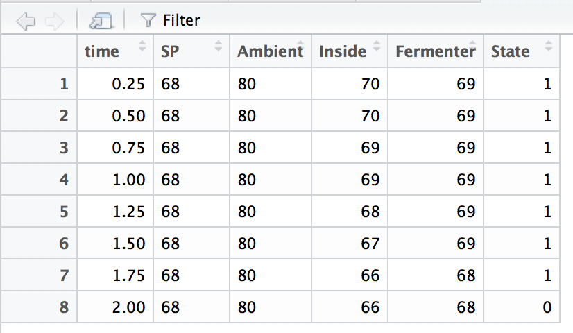

# thermoDataR
R script to read.csv thermo data file for plotting


## Getting Started

Read data from .csv to plot and monitor recorded data from arduino thermoouples

> Data set example



### Prerequisites

```
R Studio Version 1.0.153
lubridate and ggplot2 libraries
```
## Built With

* R in R Studio Version 1.0.153

## Authors

* **Paul ReFalo**

## Acknowledgements

* Thanks to RMJ for the data

## License

Open source
